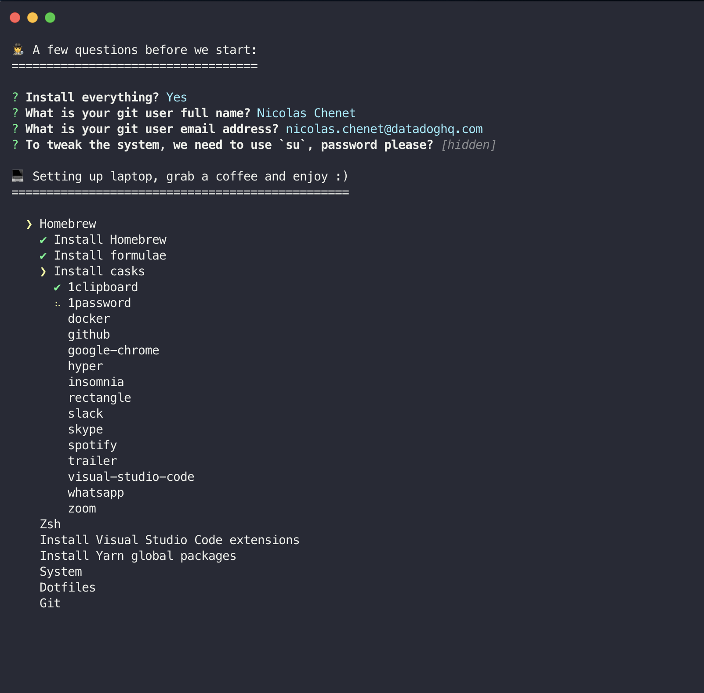

# dotfiles

[](https://a.cl.ly/6quLzm8o)

---

## Pre-requisites

### Packages
 - :octocat: You need to have `git` installed

### How to add your env and secrets
 - Create a `.secrets` file in your HOME directory
 - Put in every secret tokens or any other personal variables you need to be exported

#### Example
```
GITLAB_TOKEN:xxxxxxxxxxx
```

#### Needed variables (my use case)
- GITLAB_TOKEN

## Install

```bash
# Clone the repo
git clone https://github.com/nicolaschenet/dotfiles.git ~/.dotfiles

# Setup laptop
cd ~/.dotfiles
./install.sh
```

Executables are available in the `dist` directory if necessary.
